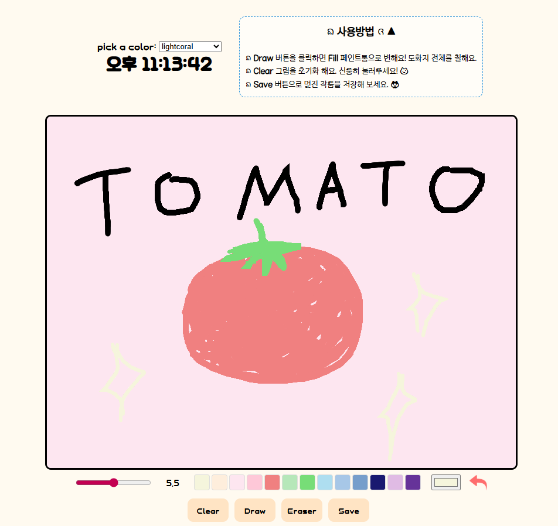

리액트의 **Hooks(useRef, useEffect, useState)**와 **Canvas API**를 활용하여 제작한 인터렉티브 그림판 및 실시간 시계 프로젝트입니다.

---

## ✨ 핵심 기능 (Key Features)

### 🖋 인터렉티브 그림판 (Drawing Board)
- **자유 드로잉**: 브러쉬 크기(`range input`)와 색상(`color picker` & `palette`) 조절이 가능합니다.
- **채우기 모드 (Fill)**: 단일 클릭으로 캔버스 전체를 선택한 색상으로 채울 수 있습니다.
- **되돌리기 (Undo)**: `Ctrl + Z` 단축키 및 버튼을 통해 직전 작업으로 되돌아가는 기능을 지원합니다.
- **커스텀 커서**: 브러쉬 크기와 선택한 색상이 실시간으로 반영되는 스마트 커서를 구현했습니다.
- **이미지 저장**: 작성한 그림을 `JPG` 파일로 원하는 위치에 직접 저장할 수 있습니다. 

### ⏰ 실시간 시계 (Digital Clock)
- 리액트의 `setInterval`을 활용하여 매초 정확한 시간을 렌더링하는 시계 컴포넌트입니다.

---

## 🛠 기술 스택 (Tech Stack)
- **Frontend**: React (Functional Components)
- **State Management**: React Hooks (`useState`, `useRef`, `useEffect`)
- **Styling**: CSS3 (Flexbox, Animations)
- **API**: HTML5 Canvas API, File System Access API

---

## 🔍 주요 트러블슈팅 (Troubleshooting)

### 1. 리액트 재렌더링 시 캔버스 초기화 이슈
- **문제**: 브러쉬 크기나 모드를 바꿀 때마다 `useEffect`가 실행되어 `canvas.width`가 재설정되면서 그림이 사라지는 현상 발생.
- **해결**: `useEffect`의 의존성 배열을 비우고(`[]`), 최신 상태값을 참조하기 위해 `useRef`를 도입하여 캔버스의 초기화를 방지함.

### 2. 클로저 문제와 실시간 상태 참조
- **문제**: `useEffect` 내부의 이벤트 리스너가 컴포넌트의 최신 `isFilling` 상태를 인지하지 못함.
- **해결**: `isFillingRef`를 생성하고 `useEffect`를 통해 상태와 Ref를 동기화하여, 리스너 내부에서 항상 최신 모드 값을 참조하도록 구현.

### 3. Canvas Undo 스택 관리
- **문제**: `Undo` 실행 시 굵기 변경 등의 메타 데이터 변경이 히스토리에 쌓이는 문제.
- **해결**: `mousedown` 시점에만 `toDataURL` 스냅샷을 찍도록 로직을 일원화하여 정확한 작업 단위의 히스토리를 관리함.

---

## 📂 프로젝트 구조 (Project Structure)
```text
src/
 ┣ Components/
 ┃ ┣ Clock.js      # 실시간 시계 컴포넌트
 ┃ ┣ Draw.js       # 메인 캔버스 로직 컴포넌트
 ┃ ┗ Manual.js     # 사용 방법 안내 토글 컴포넌트
 ┣ css/
 ┃ ┣ App.css       # 전체 스타일링 및 애니메이션
 ┃ ┣ cli.mp3       # 버튼 효과음 리소스
 ┃ ┗ undo.png      # 되돌리기 아이콘
 ┣ App.js          # 루트 컴포넌트
 ┗ index.js        # 엔트리 포인트
```



---

## 코드 공부
https://hey-an-0912.tistory.com/29
